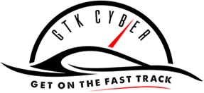
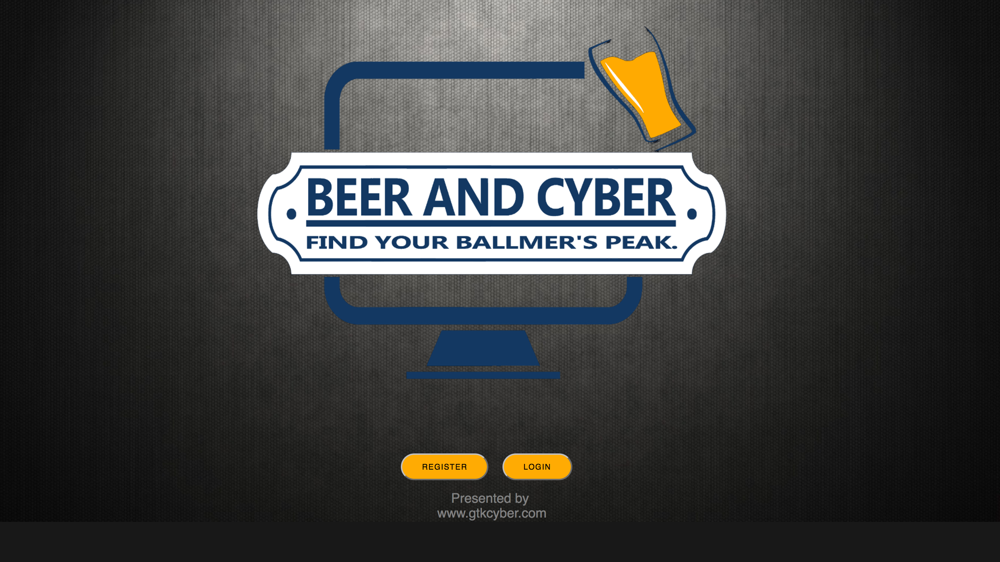

# Beer and Cyber CTF

### Beer and Cyber Data Science Capture The Flag Challenges

Presented by [GTK Cyber](https://www.gtkcyber.com)




GTK Cyber is pleased to announce that the Beer and Cyber Capture The Flag
Challenges ([www.beerandcyber.com](https://www.beerandcyber.com/ctf/default/login?_next=/ctf/default/index)) are online.
Sign up now!



### Data

The ```data``` folder contains all data files for the challenges.

**List of files**:


### Credits

- [Austin Taylor, CISSP](http://www.austintaylor.io/): Design, Concept, Content/Challenges and Maintenance
- [Melissa Kilby, PhD](https://melissackilby.com/) and [Charles Givre, CISSP](http://thedataist.com/): Content/Challenges